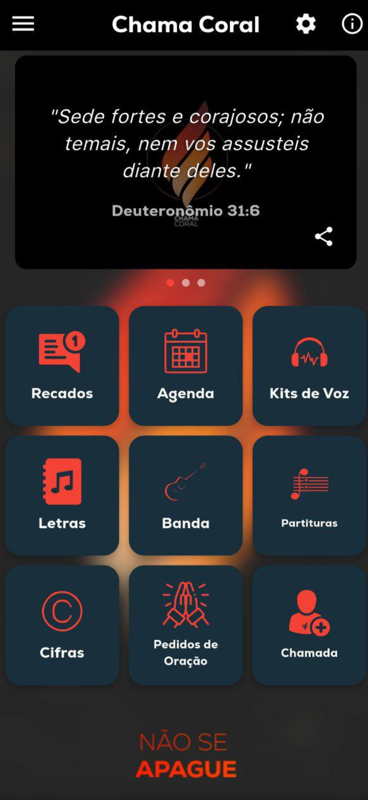
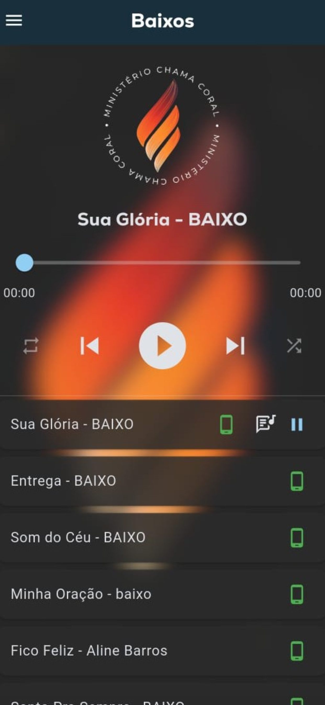
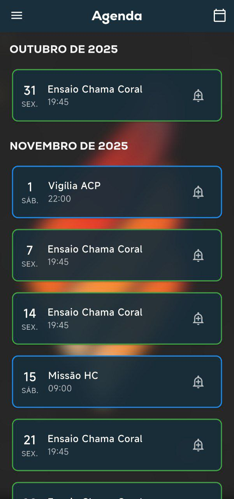

# Aplicativo Ministério Chama Coral

Este repositório serve como documentação e estudo de caso para a plataforma "Chama App", uma solução completa composta por um aplicativo móvel (iOS/Android) e um painel de administração web.

**Nota:** O código-fonte deste projeto é privado e de propriedade intelectual do desenvolvedor.

---

### Links para as Lojas

| App Store (iOS) | Google Play (Android) |
| :---: | :---: |
| [!\[Disponível na App Store\](https://developer.apple.com/assets/elements/badges/download-on-the-app-store.svg)](https://apps.apple.com/br/app/ministério-chama-coral/id6749340847) | [!\[Disponível no Google Play\](https://play.google.com/intl/en_us/badges/static/images/badges/pt-br_badge_web_generic.png)](https://play.google.com/store/apps/details?id=br.com.glinfo.chamacoral&hl=pt_BR) |

---

### Screenshots do Aplicativo

*(Adicione aqui alguns printscreens do seu app para mostrar a interface)*

| Tela de Login | Tela de Músicas | Tela de Eventos |
| :---: | :---: | :---: |
|  |  |  |

---

## O Problema

Um grupo musical com mais de 100 membros enfrentava desafios significativos de logística e comunicação, incluindo:
-   Dificuldade em distribuir partituras e áudios de ensaio de forma organizada.
-   Falta de uma fonte centralizada para o calendário de eventos e ensaios.
-   Comunicação dispersa através de múltiplos grupos de WhatsApp.

## A Solução

O "Chama App" foi desenvolvido como uma plataforma centralizada para resolver estes problemas.

-   **Aplicativo Móvel (Flutter):** Oferece aos membros acesso instantâneo a um repertório de músicas (com cifras e áudios para estudo), agenda de eventos e notificações importantes.
-   **Painel de Administração (React):** Uma interface web que permite aos administradores gerir todo o conteúdo do aplicativo (músicas, eventos, notícias) em tempo real, sem a necessidade de republicar o app nas lojas.

## Arquitetura e Tecnologias Utilizadas

-   **Frontend (Mobile):** `Flutter` e `Dart` para uma base de código única para iOS e Android.
-   **Frontend (Web Admin):** `React` e `TypeScript` para um painel de administração rápido e moderno.
-   **Backend e Base de Dados:** `Firebase` (Firestore, Firebase Storage, Authentication) para uma solução serverless, escalável e em tempo real.
-   **Notificações:** `Firebase Cloud Messaging` para enviar alertas e avisos aos utilizadores.